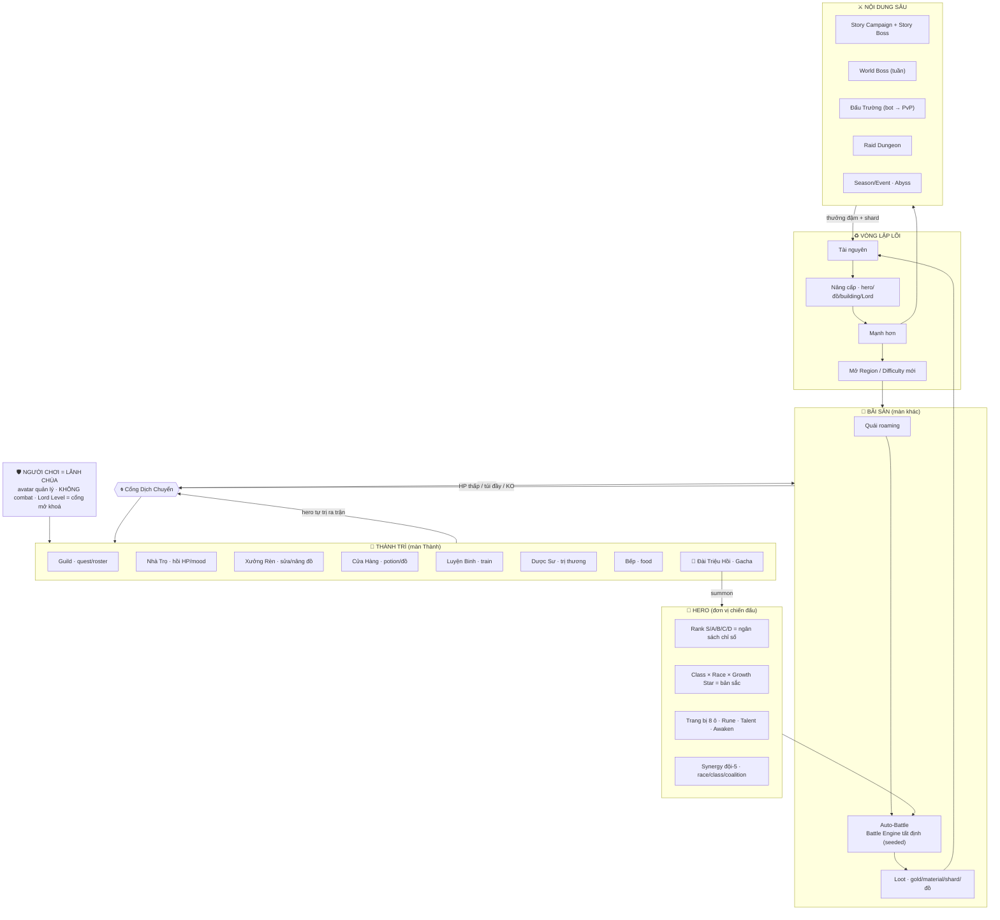
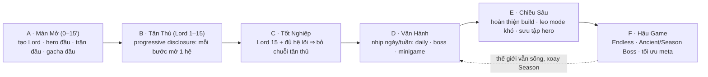
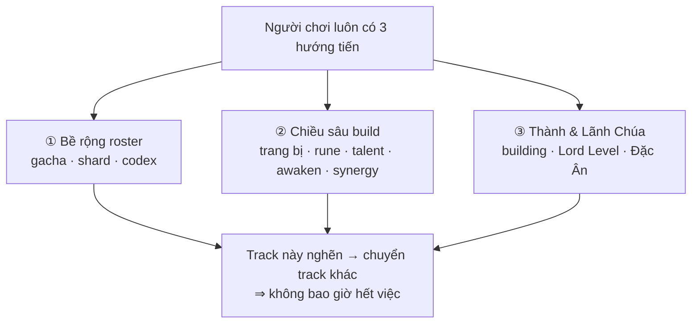

# OVERVIEW.md — Tổng quan Herogasm (Mermaid)

> Sơ đồ tổng quan **living-world Idle/AFK RPG** (cảm hứng Evil Hunter Tycoon).
> Xem cùng [FLOW.md](FLOW.md) (hành trình chi tiết) và [README.md](README.md).
> Nguyên tắc tối thượng: **Offline-First** — mọi hệ chơi trọn offline, online chỉ là lớp sync.

---

## 1) Cấu trúc game + Vòng lặp lõi

---

## 2) Hành trình người chơi (A → F)

---

## 3) Ba track tiến trình song song (luôn có việc)

---

**Ghi chú:**
- Người chơi **quản lý**, hero **tự trị** (Utility AI) — xem, không điều khiển trực tiếp.
- Combat qua **Battle Engine tất định** (seeded) dùng chung cho Bãi Săn / Stage / Boss / Arena / Raid.
- Cân bằng: *Strategy > Power* — không đội hình bất bại; content (element/modifier/objective) chọn winner theo trận (xem [TEAMBUILD.md](TEAMBUILD.md)).
